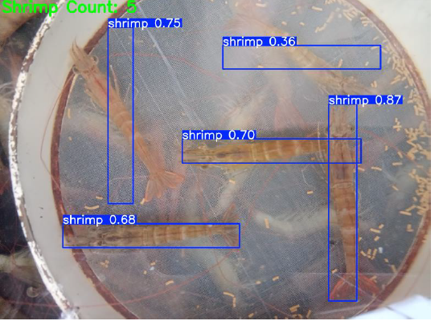

# Shrimp Counting Module Using YOLOv8 and Image Processing

## 📘 Overview
The **Shrimp Counting Module** is a part of an intelligent aquaculture monitoring system designed to automatically count the number of shrimps present in underwater feed tray images.  
By leveraging **YOLOv8** (You Only Look Once, Version 8) and **image processing techniques**, this module accurately detects and counts shrimps even under challenging water conditions.  

The module helps aquaculture farmers analyze shrimp activity, monitor feeding behavior, and optimize feed management to reduce waste and improve pond health.

---

## 🎯 Objectives
- Detect and count shrimps in underwater feed tray images.
- Automate manual counting to save time and improve accuracy.
- Generate count reports that can be integrated with the feed consumption analysis module.
- Provide real-time insights into shrimp activity and pond conditions.

---

## 🧠 Workflow

1. **Dataset Preparation**
   - Underwater shrimp images were collected from aquaculture ponds.
   - Images were annotated using **LabelImg** tool in YOLO format.
   - Dataset split into **training, validation, and testing** sets.

2. **Model Training**
   - YOLOv8 model trained using the annotated dataset.
   - Training performed on Google Colab using GPU runtime.
   - Model performance evaluated using **mAP (mean Average Precision)**, precision, and recall metrics.

3. **Prediction and Counting**
   - Trained model loaded for inference.
   - Bounding boxes generated around detected shrimps.
   - Shrimp count calculated as the total number of detected bounding boxes per image.

4. **Result Visualization**
   - Images with detected shrimps are saved in the `outputs/` folder.
   - Each output image displays:
     - Bounding boxes for each detected shrimp.
     - The total shrimp count overlaid on the image.

---

## 🧰 Technologies and Tools Used
- **Programming Language:** Python   
- **Object Detection Model:** YOLOv8  
- **Annotation Tool:** CVAT  
- **Libraries:** OpenCV, Ultralytics YOLO  
- **Environment:** Google Colab  

---

## ▶️ How to Run
1. Open the notebook in **Google Colab**.  
2. Upload the dataset and model weights (if available).  
3. Run all cells sequentially.  
4. View results in the `outputs/` folder or final cell outputs.

---

## 📊 Results
- Achieved a mean Average Precision (mAP@0.5) of **0.90** on validation data.  
- Successfully detected and counted shrimps in various lighting and water conditions.  

Example output:

| Detection Output |
|------------------|
|  |

---
